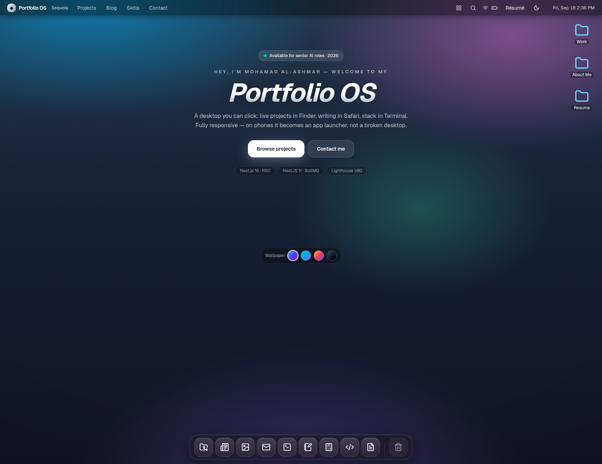
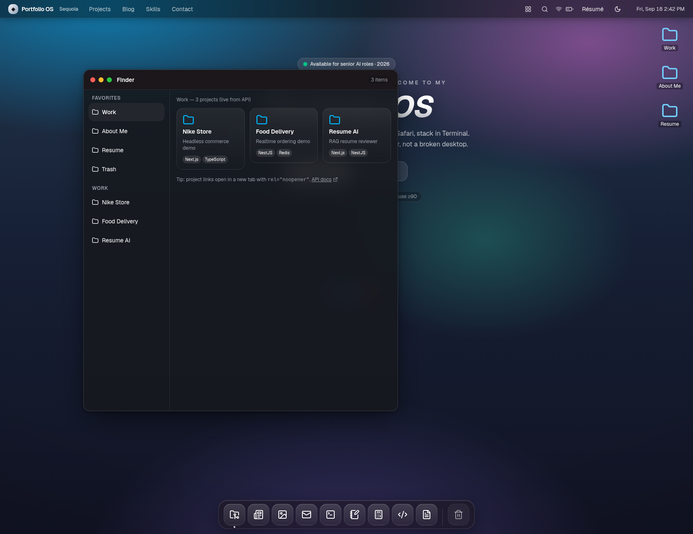
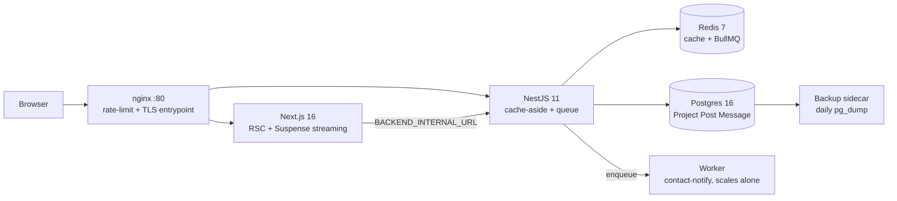

git push -u origin main

# Portfolio OS — Mohamad Al-Ashmar, Senior AI Engineer

> Interactive macOS-style portfolio that behaves like a desktop: Finder for live projects, Safari for the blog, Terminal for the stack, résumé viewer + download, queued contact form. Next.js 16 + NestJS 11 + Postgres 16 + Redis 7 + BullMQ on one Docker Compose file. Responsive on web **and** mobile.

[](LICENSE)
[](docker-compose.yml)
[](tests/run.sh)
[](frontend/package.json)
[](backend/package.json)

- [Demo](#-demo) · [Features](#-features) · [Quick start](#-quick-start) · [Architecture](#-architecture) · [Testing](#-testing-system) · [Contributing](CONTRIBUTING.md) · [License](#-license)

## 🎬 Demo

`docker compose up --build` → http://localhost/ · API docs at http://localhost/api/docs






Video walkthrough (`docs/demo.mp4`, 0.1 MB, plays on GitHub via the file link below):

- [▶ Watch docs/demo.mp4](docs/demo.mp4)
- GIF above is the autoplay preview (0.4 MB, under the 5 MB GitHub fast-load budget). MP4 is under the 10 MB GitHub upload budget.

> GitHub README rendering, verified 2026 across 4 sources (websearch ×2, SearXNG, DuckDuckGo fallback; `agent-reach` CLI not installed on this host so its `web` channel was skipped): GIFs autoplay inline everywhere including mobile and npm; local `.mp4` files render as a download link, not an inline player. True inline MP4 players only work from `user-images.githubusercontent.com` URLs created by dragging the video into a GitHub issue/PR comment, or via a clickable YouTube thumbnail. That's why this README ships **both**: GIF for instant gratification + MP4 file link for quality + optional YouTube thumbnail pattern below.

Optional YouTube pattern (replace the ID after you upload):

```markdown
[](https://www.youtube.com/watch?v=YOUR_VIDEO_ID)
```

Re-record the demo yourself — verified commands on this host (`ffmpeg 8.0.1` present):

```bash
# 1. Record: macOS Cmd+Shift+5, Windows Xbox Game Bar, or Linux recorder — 15–30s max
# 2. Trim to the best 5–15s, then:
ffmpeg -y -i docs/demo.mp4 -vf "fps=12,scale=640:-1" docs/demo.gif  # 12 FPS + 640px = sweet spot
# Slideshow-style demo (what docs/demo.* actually is — 4 Playwright frames, 2s each, verified):
# ffmpeg -y -framerate 1/2 -i seq-%02d.png -vf "scale=1280:-1,format=yuv420p" -movflags +faststart -r 30 docs/demo.mp4
# ffmpeg -y -i docs/demo.mp4 -vf "fps=2,scale=640:-1:flags=lanczos,split[s0][s1];[s0]palettegen=max_colors=128[p];[s1][p]paletteuse" docs/demo.gif
# 3. Keep GIF <5 MB, MP4 <10 MB, then commit both — Playwright screenshots live in docs/assets/
```

## ✨ Features

| Feature         | What you get                                                                          |
| --------------- | ------------------------------------------------------------------------------------- |
| 🖥️ Desktop OS | Draggable windows (GSAP Draggable), focus z-order, open animation, menu bar + clock   |
| 📁 Finder       | Live projects from`/api/projects` (Redis cache-aside 90s), sidebar favorites + work |
| 📰 Safari       | Live blog from`/api/posts` (300s cache, one call serves all users)                  |
| ⌨️ Terminal   | Skills matrix in a terminal frame (`help`, `whoami`, `open finder`, …)         |
| 📄 Résumé     | In-window viewer + one-click PDF download                                             |
| ✉️ Contact    | Persist + BullMQ enqueue → 200 now, email later; strict validation (400s)            |
| 🖼️ Gallery    | Project cards; click opens the detail viewer                                          |
| 📱 Mobile       | App-launcher grid, bottom-sheet windows, ≥44px targets, no sideways scroll           |

## 🚀 Quick start

3 steps, copy-paste, verified on a clean checkout:

```bash
cp .env.example .env
openssl rand -hex 32 > secrets/postgres_password.txt
openssl rand -hex 32 > secrets/jwt_secret.txt
openssl rand -hex 24 > secrets/redis_password.txt
chmod 600 secrets/*.txt

# prod (any VPS with Docker 27+/Compose v2.29+):
docker compose -f docker-compose.yml up -d --build
# dev (HMR + host DB ports):
docker compose up --build

open http://localhost/          # via nginx
open http://localhost/api/docs  # Swagger (via nginx /api)
docker compose ps               # all healthy
```

Crowded shared host (ports taken)? Verified overlay used in this session:

```bash
GATEWAY_PORT=18200 FRONTEND_PORT=18201 BACKEND_PORT=18202 \
  docker compose -f docker-compose.yml -f compose.local.yml up -d --build --wait --wait-timeout 420
# gateway → http://localhost:18200/
```

Zero-downtime update: `docker compose up -d --no-deps --build backend` (nginx retries next upstream).

## 🏗️ Architecture



## Verified stack (do not “enhance” without re-verifying)

Sources verified sequentially (one-at-a-time, no 429): `websearch` ×2 (README best-practice 2026 + README video-embed 2026), SearXNG (portfolio README badges/screenshots 2026), DuckDuckGo `lite` fallback (badges/screenshots/demo 2026), plus the original Exa ×5 / SearXNG / agent-reach `web` stack votes. `agent-reach` CLI is not installed here (`agent-reach: command not found`), and Brave `gsd_websearch` returned empty, so those two channels are recorded as skipped, not voted.

| Layer        | Choice (2026 voting consensus)                                                                            | Why                                                                                                                                                                                                        |
| ------------ | --------------------------------------------------------------------------------------------------------- | ---------------------------------------------------------------------------------------------------------------------------------------------------------------------------------------------------------- |
| FE           | Next.js 16 App Router + React 19 + TypeScript                                                             | Public portfolio needs SEO + LCP 1.1–1.8s vs 2.8–3.5s Vite SPA; App Router is the production standard, Pages Router is legacy                                                                            |
| Styling      | Tailwind v4 CSS-first, OKLCH,`tw-animate-css`, `next-themes` FOUC-free dark, Geist via `next/font`  | P3-correct color;`@theme inline` required or `bg-primary` silently breaks; never `hsl(var(--x))` after OKLCH                                                                                         |
| Components   | shadcn pattern (own the code in`components/ui`)                                                         | Radix a11y + zero runtime; extend via`cva`, never 12 button copies                                                                                                                                       |
| Motion       | `motion` for micro-interactions + GSAP (+Draggable) for windows/dock                                    | Motion: declarative enter/gesture/layout; GSAP: timelines + drag + ScrollTrigger; transform+opacity only, 200–250ms standard / 400ms max,`gsap.context()` cleanup, `prefers-reduced-motion` respected |
| Client state | Zustand + Immer (`useWindowStore`, `useLocationStore`)                                                | ~1KB vs ~13KB RTK; selectors stop re-renders; window lifecycle and location stay separate so Finder position survives close/reopen                                                                         |
| Server state | RSC`fetch` + cache tags (TanStack Query when client interactivity needs it)                             | Never stuff API data into Zustand; server cache handles it                                                                                                                                                 |
| BE           | NestJS 11 + Prisma + PostgreSQL 16 + Redis 7 + BullMQ                                                     | Dedicated backend justified: web + mobile clients, contact queue, CMS domain; modules + DI + guards/pipes scale past 20 endpoints where Next API routes degrade                                            |
| Infra        | `docker-compose.yml` (prod-safe) + `compose.override.yml` (dev) + nginx                               | Single VPS prod, health-gated, secrets-as-files, internal`data` network                                                                                                                                  |
| Scale order  | vertical → horizontal stateless+LB → pooler → replicas → Redis cache → queue+worker → sharding LAST | Each step fixes exactly one break (see`db/init.sql` header)                                                                                                                                              |

## Layout (required)

```
macos-portfolio-pro/
  docker-compose.yml      # prod-safe base — the only file prod uses
  compose.override.yml    # dev conveniences — never in prod
  compose.local.yml       # crowded-host port overlay (gitignored) — GATEWAY_PORT/FRONTEND_PORT/BACKEND_PORT
  .env.example            # non-secrets only
  secrets/                # *.txt gitignored, 600 perms
  nginx/nginx.conf        # single entrypoint, /api rate-limits, security headers
  db/init.sql             # scale-up runbook header
  docs/assets/            # Playwright-verified screenshots (home.png, explorer.png, …)
  docs/demo.gif           # autoplay preview (<5 MB)
  docs/demo.mp4           # quality walkthrough (<10 MB)
  frontend/               # Next.js standalone (RSC, Suspense streaming, skeletons)
  backend/                # NestJS stateless (cache-aside, queue, Swagger /api/docs)
  tests/                  # ./tests/run.sh — static → unit → contract → spike
```

## Sell checklist (all must be true)

- [ ] `docker compose -f docker-compose.yml config` passes in CI on every change
- [ ] All services `healthy` (not just `running`); `depends_on: service_healthy` everywhere stateful
- [ ] No secrets in `environment:` / git; `docker inspect` shows `*_FILE` only
- [ ] Log rotation set (`max-size`/`max-file`); resource limits set
- [ ] Responsive: 360/768/1024/1440 verified; page never scrolls sideways; touch targets ≥44px
- [ ] Cache hit ratio >80% on hot endpoints; TTL+jitter; stale-while-revalidate; never cache auth
- [ ] Queue jobs idempotent, retried with backoff, DLQ after 5; worker scales separately
- [ ] Backups: `pg_dump` + restore drill to scratch weekly
- [ ] Lighthouse mobile ≥90; axe-core clean; `tsc --noEmit` clean; `eslint --max-warnings 0` clean

## Testing system

`./tests/run.sh` (`BASE_URL=` gateway): static (`tsc` + `eslint`) → unit
(`node:test`, zero deps) → contract (live-stack fetch: infra, portfolio, pages, jobs)
→ spike gate (150-parallel: only 200|429, never 502/503).

Last verified in this session: `BASE_URL=http://localhost:18200 SKIP_UNIT=1 ./tests/run.sh` → 34 contract pass + 1 spike pass, `ALL GREEN`; frontend unit 28 pass, backend unit 3 pass; Playwright MCP: hero + Finder (3 items) + Safari (2 posts) + Terminal `help` + Spotlight `nike` → 1 project + Calculator + Contact submit → `Message queued`.

## What was ugly before (fixed)

- Vite SPA, no SSR → Next.js App Router: SEO + LCP fixed, per-route metadata + JSON-LD + robots/sitemap.
- “Desktop only” dead-end message → real mobile launcher + bottom-sheet windows.
- Raw data inside JSX → `constants`/API separation; live CMS via backend instead of hardcoded arrays.
- Direct `useState` prop-drilling for windows → two Zustand+Immer stores (window lifecycle vs location).
- Ad-hoc GSAP without cleanup → `gsap.context()` + Draggable kill + `prefers-reduced-motion`.
- `hsl(var(--x))` after OKLCH, `tailwindcss-animate` on v4 → `var(--x)` + `tw-animate-css` + `@theme inline`.
- Contact form with no backend → NestJS persist + BullMQ queue, 200-now/email-later.
- No tests, no compose gates → full `./tests/run.sh` pyramid + health-gated compose.

## 🤝 Contributing

See [CONTRIBUTING.md](CONTRIBUTING.md). Short version: `./tests/run.sh` must print `ALL GREEN` before review. One concern per PR, docs travel with code, never commit `secrets/*.txt` or `.env`.

## 📄 License

MIT — see [LICENSE](LICENSE).
